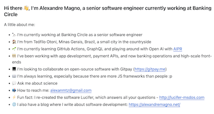
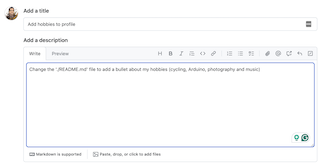
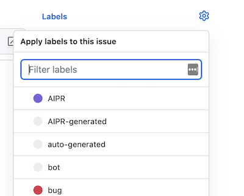
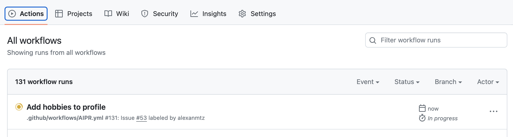
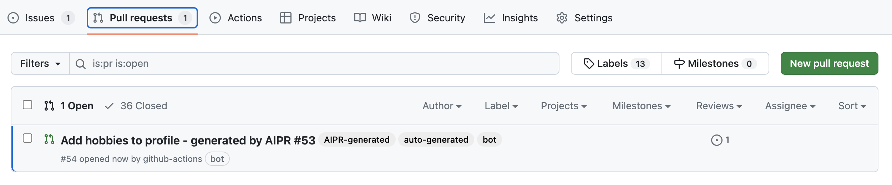
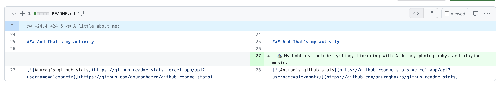
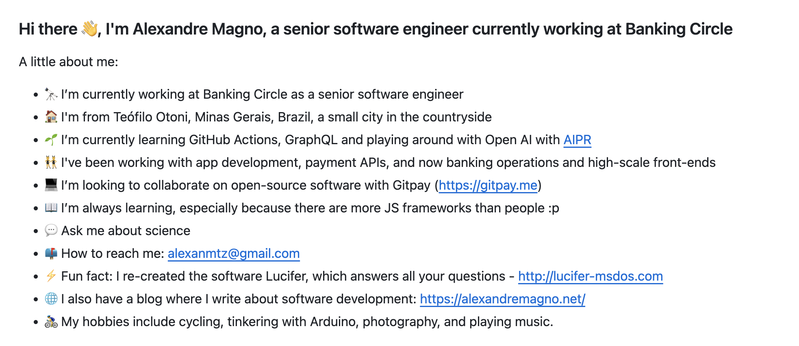

# Getting Started with AIPR


AIPR (AI-Powered Pull Request) is a Github action designed to streamline issue resolution and improve collaboration within project teams. This action uses ChatGPT by OpenAI to create a pull request (PR) for issues labeled "AIPR" in the repository. The PR created by AIPR contains a solution generated by ChatGPT. 

This action is designed to make it faster and easier to resolve issues and improve the overall efficiency of software development teams.

## How AIPR Works

1. When an issue is labeled "AIPR" in a project repository, the AIPR Github action is triggered.
2. The action uses the issue description and comments to generate a solution using ChatGPT.
3. The solution is added to a new PR and pushed to the repository.
4. Project collaborators can review the solution and merge the PR if they decide it is appropriate.

## Install

Go to the AIPR project on marketplace [AIPR on Github Marketplace](https://github.com/marketplace/actions/creates-a-pr-to-solve-an-issue-using-chatgpt) and follow the instructions:


## Applications

1. Improve documentation
2. File refactoring
3. Fix bugs
_and many others_

## Example

  
*Here's an example of documentation in my profile, that I would like to use AIPR to change it*
___
  
*Then I created an issue asking to change the file content to add a new section about my hobbies*
___
  
*When you add a label AIPR it will trigger the action and you will receive a PR with a solution for that issue*
___
  
*The Github action will run and it will call the OPEN AI API to create a solution for your issue based in your configuration and OPEN AI token provided*
___
    
*A Pull Request will be send with the solution*
___
 
*You can see the diff and review the code from AIPR*
___
  
*You can see the diff and review the code from AIPR*
___

## Limitations

There are a few limitations to keep in mind when using AIPR, including:

- AIPR only works for one file, so you need to specify the file in the format './filename.ext', a relative path to the repository.
- To ensure the most accurate solution, it is important to be as descriptive as possible in the issue description and comments.

## Example of an issue
Add a section on the bottom of the file './README.md' about the author of the project, Alexandre Magno (https://github.com/alexanmtz).
[https://github.com/alexanmtz/AIPR/issues/10](https://github.com/alexanmtz/AIPR/issues/10)

## How to Use AIPR in Your Project

1. Install the AIPR Action on the marketplace: https://github.com/marketplace/actions/creates-a-pr-to-solve-an-issue-using-chatgpt.
2. Label an issue in your project repository with "AIPR".
3. Once the issue is labeled, the AIPR Github action will automatically create a PR to solve the issue using ChatGPT.
4. Alternatively, you can manually trigger AIPR by commenting on the issue, such as "Create PR with AIPR 🚀." This will also create a PR using ChatGPT.

## Sample Workflow File

A sample workflow file `AIPR.yaml` inside the workflow folder could look like this:

```
on:
  issues:
    types: [labeled, reopened]
  issue_comment:
    types: [created]

permissions:
  contents: write
  issues: write
  pull-requests: write

jobs:
  Creating-PR-using-AIPR:
    if: ${{ (github.event_name == 'issues' && 
    contains ( github.event.label.name, 'AIPR')) || 
    (github.event_name == 'issue_comment' && 
    github.event.issue.pull_request &&
    contains( github.event.comment.body, 'Create PR with AIPR 🚀')) }}
    runs-on: ubuntu-latest
    steps:
    - name: Executing AIPR action
      uses: alexanmtz/AIPR@main
      with:
        openai_api_key: ${{ secrets.OPENAI_API_KEY }}
        openai_tokens: 200 #default is 200
        target_branch: main
        file_chunks: 10000 # split processing in chunks
```

## Author
This project was created by Alexandre Magno (https://github.com/alexanmtz).

Generated by AIPR
